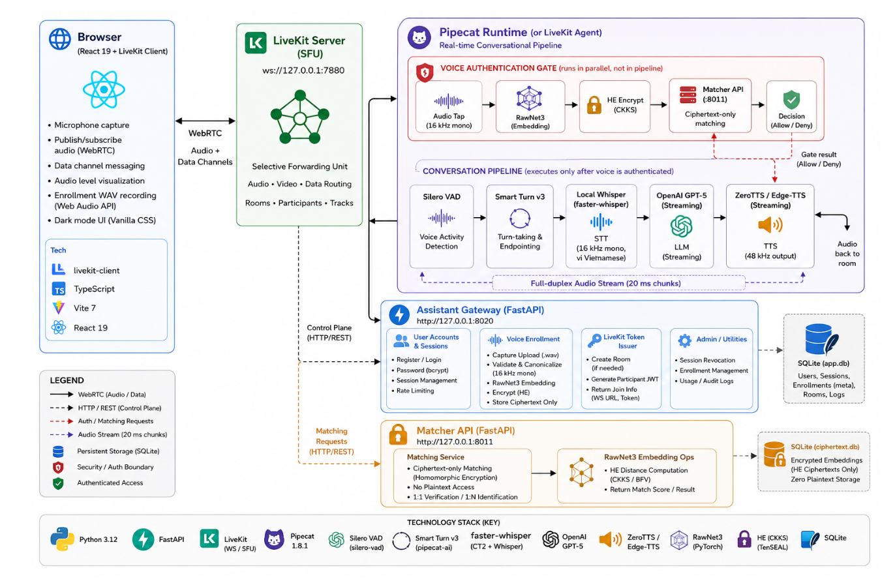
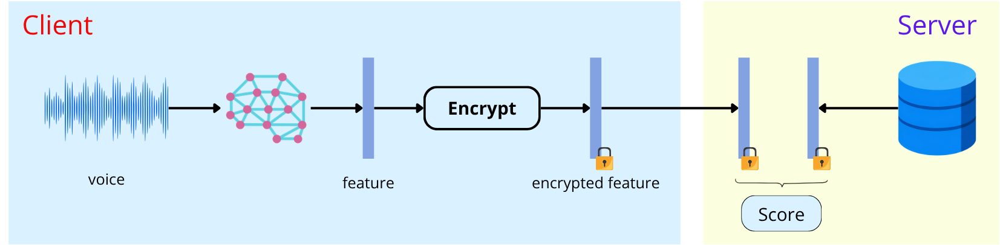

# Who-Speak-AI

A privacy-preserving, voice-authenticated virtual assistant. Who-Speak-AI combines fine-tuned speaker verification with homomorphic encryption and real-time conversational voice agents — your biometric data stays private while the assistant stays personal.

---

## What It Does

1. **You register and enroll your voice** — three spoken samples are processed into a 256-dimensional speaker embedding using a fine-tuned RawNet3 model.
2. **Your voiceprint is encrypted** — the embedding is encrypted with CKKS homomorphic encryption (TenSEAL) before it crosses the Matcher API boundary. The Matcher API only receives ciphertext.
3. **You talk to the assistant** — a real-time Pipecat pipeline connects you through WebRTC (LiveKit), transcribes your speech locally with PhoWhisper, generates replies with the configured OpenAI model, and speaks back using ZeroTTS — all in Vietnamese.
4. **Private tools require voice auth** — before the assistant accesses your calendar or personal data, it challenges you to speak and verifies your identity against the encrypted voiceprint. No match, no access.

---

## Demo

<p align="center">
  <video
    src="https://github.com/user-attachments/assets/623f11a5-04ff-4c4f-96d2-7422f9cf93e2"
    controls
    width="900"
  >
    Your browser does not support video playback.
  </video>
</p>

---

## Architecture Overview

<p align="center">
  
</p>

<p align="center"><em>System architecture of Who-Speak-AI.</em></p>

The active local voice path is the Pipecat runtime. The legacy LiveKit Agents
implementation remains available as an alternate runtime and should not be run
alongside Pipecat in the same room.

```text
Browser → LiveKit SFU → Pipecat AuthRouterProcessor
                         ├─ voice challenge → RawNet3 → encrypted Matcher API
                         └─ conversation audio → VAD → Smart Turn → STT
                                                   → Conversation/LLM → TTS
                                                   → LiveKit audio output
```

`AuthRouterProcessor` is the first processor in the Pipecat pipeline. During a
voice challenge it captures or discards audio and does not forward it to VAD,
STT, the LLM, or TTS. General conversation may run as Guest, while private
Calendar tools require successful VoiceAuth and an active Google Calendar
connection.

## Technical Inventory

| Subsystem | Model / Technology | Runtime | Operational configuration |
|------------|--------------------|---------|---------------------------|
| VAD | Silero VAD v5 | Pipecat / PyTorch | Confidence `≥ 0.7`; `384 ms` onset; `650 ms` silence; `20 s` maximum utterance |
| Turn-taking | Smart Turn v3.2 (`.onnx`) | Pipecat / ONNX Runtime | Whisper-style log-Mel input; model window up to `8 s`; force-stop wait up to `2 s` |
| Speech-to-text | PhoWhisper-small-ct2 | faster-whisper / CTranslate2 | CPU `int8`; `16 kHz` mono; language `vi`; in-memory decoding |
| LLM reasoning | OpenAI (`OPENAI_MODEL`) | AsyncOpenAI Responses API | Streaming response; model selected by environment (`gpt-5-nano` in the local setup) |
| TTS chunking | SentenceBuffer | Custom Python | Splits at punctuation or `VOICE_TTS_MAX_SENTENCE_CHARS` (`120`) before TTS |
| Neural TTS | ZeroTTS (`maichi`) | ONNX Runtime | Local `48 kHz` mono stream; Edge-TTS fallback |
| Speaker verification | RawNet3 (ViMD fine-tuned) | PyTorch / Sinc-Conv | `256-D` L2-normalized embeddings |
| Encryption | TenSEAL CKKS | TenSEAL `0.3.16` | Polynomial degree `8192`; coefficient moduli `[60, 40, 40, 60]`; global scale `2^40` |
| Key protection | OS keychain | `keyring` | CKKS private context is unavailable to the Matcher API and browser |
| Tool policy | PolicyToolExecutor | Native Python | Auth-state-gated Calendar access through the gateway; local MCP or mock provider by configuration |

---

## Requirements

| Requirement | Version | Why |
|-------------|---------|-----|
| **Python** | 3.12.x (`>=3.12, <3.13`) | Backend services, ML inference, agent workers |
| **uv** | Latest (`>=0.4.0`) | Fast Python package and virtual environment manager |
| **Node.js** | 20+ or 22+ LTS (`>=20.19.0 \|\| >=22.12.0`) | Vite dev server and React frontend build |
| **LiveKit Server** | Latest stable binary | WebRTC media routing at `ws://127.0.0.1:7880` |
| **OS Keychain** | macOS Keychain / Linux Secret Service | Stores private CKKS encryption keys securely |

---

## Getting Started

### 1. Clone and set up Python with `uv`

```bash
git clone https://github.com/beaver-felix/Who-Speak-AI.gits
cd Who-Speak-AI

# Create and activate a Python 3.12 virtual environment
uv venv --python 3.12 .venv
source .venv/bin/activate

# Install PyTorch for your platform (CPU or CUDA)
uv pip install torch --index-url https://download.pytorch.org/whl/cpu

# Install all dependencies
uv pip install -r requirements.txt
```

Alternatively, install in editable mode with all extras:

```bash
uv pip install -e "app/voice_verification[ui,matcher,he,model,agent,gateway,pipecat,providers,test]"
```

### 2. Configure environment

```bash
cp app/voice_verification/.env.example app/voice_verification/.env.local
```

Edit `.env.local` with your secrets:
- `OPENAI_API_KEY` — required for GPT-5 conversation
- `LIVEKIT_API_KEY` / `LIVEKIT_API_SECRET` — required for WebRTC
- `VOICE_MATCHER_TOKEN` — shared secret for the Matcher API (min 8 characters)
- `PIPECAT_SUPERVISOR_SECRET` — required in Pipecat mode (min 32 characters)

Google Calendar is disabled by default. Keep `MCP_PROVIDER=mock` for the local
demo. To test the read-only remote Calendar MCP integration, configure a Web
application OAuth client and add the callback URI
`http://127.0.0.1:8020/api/integrations/google-calendar/callback` in Google
Cloud, then set `GOOGLE_OAUTH_CLIENT_ID`, `GOOGLE_OAUTH_CLIENT_SECRET`, and a
32-byte URL-safe `GOOGLE_TOKEN_ENCRYPTION_KEY`. Finally set
`MCP_PROVIDER=mcp`. Tokens remain encrypted in the gateway SQLite database;
they are never sent to the browser, LiveKit, or OpenAI. The remote Calendar
MCP endpoint is a Google Workspace Developer Preview, so use a dedicated test
account and return to `MCP_PROVIDER=mock` if it is unavailable.

### 3. Start the services

Open five terminals:

```bash
# 1. LiveKit WebRTC Server
app/voice_verification/scripts/run_livekit_server_local.sh

# 2. Matcher API (port 8011)
app/voice_verification/scripts/run_matcher_local.sh

# 3. Assistant Gateway (port 8020)
app/voice_verification/scripts/run_gateway_local.sh

# 4. Pipecat Supervisor (port 8021)
app/voice_verification/scripts/run_pipecat_supervisor_local.sh

# 5. Web frontend (port 5173)
cd app/web && npm install && npm run dev
```

### 4. Use it

Open **http://127.0.0.1:5173**, register an account, enroll your voice (three samples), and start talking to the assistant.

When the gateway is configured with `MCP_PROVIDER=mcp`, open the Google
Calendar card in the workspace and connect the Google account whose verified
email exactly matches the Who Speak account. Voice authentication is still
required before the Agent can read personal events. The MVP exposes only
`calendar.list_events`; event creation is intentionally disabled until its
confirmation and idempotency flow is implemented.

---

## Project Structure

```
Who-Speak-AI/
├── app/
│   ├── web/                        # React 19 + Vite 7 frontend
│   │   ├── src/                    # Components: VoiceStage, ConversationPanel, LiveKitPanel
│   │   ├── package.json            # Frontend dependencies
│   │   └── vite.config.ts          # Dev server config (proxies /api → :8020)
│   │
│   ├── assistant/                  # Real-time voice agent pipeline
│   │   ├── pipecat_runtime/        # Pipecat 1.8.1 pipeline & session supervisor
│   │   ├── providers/              # Whisper, ZeroTTS, Edge-TTS, OpenAI LLM
│   │   ├── tools/                  # PolicyToolExecutor + gateway-backed CalendarProvider
│   │   ├── simulations/            # YAML dialogue scenarios for policy tests
│   │   ├── livekit_agent.py        # LiveKit Agents-based runtime (alternate)
│   │   ├── config.py               # All runtime configuration from env vars
│   │   └── streaming.py            # SentenceBuffer for chunked TTS input
│   │
│   ├── assistant_gateway/          # FastAPI gateway (:8020)
│   │   ├── main.py                 # Routes: register, login, enroll, token
│   │   ├── security.py             # scrypt password hashing, session tokens
│   │   └── store.py                # SQLite: users, sessions, voice_profiles
│   │
│   └── voice_verification/         # Speaker verification & encryption
│       ├── apps/matcher_api/       # Matcher service (:8011), ciphertext-only
│       ├── src/voiceauth/          # RawNet3, TenSEAL HE, keychain storage
│       ├── scripts/                # Launch scripts for each service
│       ├── streamlit_app.py        # Standalone testing dashboard
│       └── pyproject.toml          # All Python dependency definitions
│
├── model/                          # RawNet3 training & evaluation pipeline
├── techincal-report/               # Technical report documentation
├── requirements.txt                # Consolidated Python dependencies
├── STACK.md                        # Complete technology stack inventory
└── GUIDE_RAWNET3.md                # RawNet3 model guide
```

---

## Key Technologies

### Voice Pipeline

| Stage | Technology | Details |
|-------|-----------|---------|
| **Voice Activity Detection** | Silero VAD v5 | Neural VAD with 0.7 confidence threshold |
| **Turn Detection** | Smart Turn v3 | Local ONNX model preventing premature cut-offs |
| **Speech-to-Text** | PhoWhisper-small-ct2 | CTranslate2 int8 on CPU, configured for Vietnamese |
| **Language Model** | OpenAI (`OPENAI_MODEL`) | Streaming responses via the Responses API |
| **Text-to-Speech** | ZeroTTS (`maichi` voice) | Local 48 kHz neural streaming, Edge-TTS fallback |

### Speaker Verification

| Component | Details |
|-----------|---------|
| **Model** | RawNet3, fine-tuned on ViMD dataset, 256-D embeddings |
| **Encryption** | CKKS homomorphic encryption (TenSEAL), `poly_modulus_degree=8192` |
| **Matching** | Encrypted squared Euclidean distance; trusted voice-auth code derives cosine similarity after decryption |
| **Key Storage** | OS keychain via `keyring` (`who-speak.voice-he` service) |



<p align="center"><em>Voice verification workflow: RawNet3 embedding, CKKS encryption, ciphertext-only matching, and the final authorization decision.</em></p>

### Security

| Mechanism | Implementation |
|-----------|---------------|
| **Passwords** | scrypt (N=16384, r=8, p=1) with 16-byte random salt |
| **Sessions** | HttpOnly cookie, 32-byte token, SHA-256 digest stored, 8-hour TTL |
| **Inter-service auth** | Bearer tokens with min 32-character shared secrets |

---

## Testing

```bash
# Backend tests
uv run pytest app/voice_verification/tests/

# Frontend tests
cd app/web && npm test

# Dialogue simulation tests
# Uses YAML scenarios in app/assistant/simulations/
```

---

## Documentation

- [STACK.md](STACK.md) — Full technology stack with exact version constraints
- [GUIDE_RAWNET3.md](GUIDE_RAWNET3.md) — RawNet3 model training and evaluation
- [app/voice_verification/README.md](app/voice_verification/README.md) — Speaker verification, HE details, agent lifecycle
- [app/web/README.md](app/web/README.md) — Web client architecture and setup

---

## Contributors

| Name | Student ID | Email |
|------|-----------|-------|
| Nguyen Manh Cuong | 23127034 | nmcuong23@clc.fitus.edu.vn |
| Nguyen Tran Thien An | 23127315 | nttan23@clc.fitus.edu.vn |
| Nguyen Dong Thanh | 23127538 | ndthanh23@clc.fitus.edu.vn |
